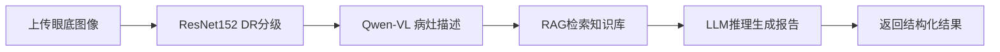

# Multimodal DR Diagnosis System

这是一个用于诊断糖尿病视网膜病变（DR）的多模态智能系统，结合了眼底图像分析和RAG增强推理。

## 🌟 核心特性

- **DR智能分级**：基于ResNet152的深度学习模型，自动判断DR严重程度
- **病灶视觉描述**：使用Qwen-VL多模态模型生成专业的眼底病灶描述
- **RAG增强推理**：结合医疗知识库，生成可追溯的诊疗决策报告
- **灵活部署模式**：支持本地模型和API调用两种运行模式

## 📂 项目结构

```
multimodal_diagnosis_system/
├── app/                    # 主应用代码
│   ├── core/              # 核心组件
│   │   ├── vision/        # 视觉模型（DR分级、Qwen-VL）
│   │   ├── llm/           # 大语言模型加载器
│   │   ├── rag/           # RAG检索增强生成
│   │   └── api_models.py  # API模型包装器
│   ├── api/               # FastAPI路由和数据模式
│   ├── services/          # 业务逻辑服务
│   ├── config/            # 配置管理
│   └── utils/             # 工具函数
├── data/                  # 数据存储
│   ├── vector_db/         # 向量数据库
│   └── knowledge_base/    # 医疗知识库
├── models/                # 模型权重文件
├── scripts/               # 工具脚本
├── web/                   # 前端界面
└── run_service.py         # 服务启动入口
```

## ⚙️ 运行模式

系统支持两种运行模式，通过配置文件控制：

### 1️⃣ API模式（推荐，默认）

**适用场景**：硬件资源有限，无法运行大型本地模型

**优势**：
- ✅ 显存需求低（仅需运行ResNet152）
- ✅ 无需下载Qwen-VL和R1-7B大模型
- ✅ 推理速度快，成本可控

**需要配置**：
- DashScope API Key（Qwen-VL）
- DeepSeek API Key（推理大模型）

### 2️⃣ 本地模式

**适用场景**：拥有充足GPU资源（建议16GB+显存）

**优势**：
- ✅ 数据隐私性高
- ✅ 无API调用成本
- ✅ 离线可用

**需要配置**：
- 下载完整模型权重文件

## 🚀 快速开始

### 前置要求

- Python 3.8+
- （可选）CUDA-enabled GPU，用于本地模式

### 安装步骤

#### 1. 安装依赖

```bash
pip install -r requirements.txt
```

#### 2. 配置运行模式

复制环境变量模板：
```bash
cp .env
```

编辑 `.env` 文件：

**API模式（默认）：**
```bash
DR_SYSTEM_USE_API_MODELS=True
DR_SYSTEM_DASHSCOPE_API_KEY=your_dashscope_api_key_here
DR_SYSTEM_DEEPSEEK_API_KEY=your_deepseek_api_key_here
```

**本地模式：**
```bash
DR_SYSTEM_USE_API_MODELS=False
# 确保模型文件已下载到 models/ 目录
```

#### 3. 准备模型权重

**API模式**：
- 仅需下载 `models/best_model_resnet152_simple_finetune.pth`（DR分级模型）

**本地模式**：
- `models/best_model_resnet152_simple_finetune.pth`
- `models/Qwen-VL/`（Qwen-VL完整模型）
- `models/R1-7B-finetuned/`（R1-7B完整模型）

> 模型路径可在 `app/config/settings.py` 中自定义

#### 4. 初始化知识库向量数据库

```bash
python scripts/init_vector_db.py
```

此步骤会将 `data/knowledge_base/dr_treatment_guidelines.txt` 转换为向量数据库。

#### 5. 启动服务

```bash
python run_service.py
```

服务将在 `http://localhost:8000` 启动。

- API文档：`http://localhost:8000/docs`
- 前端界面：打开 `web/frontend.html`

## 📖 使用指南

### API调用示例

```python
import requests
from PIL import Image
import io

# 上传图像进行诊断
with open("fundus_image.jpg", "rb") as f:
    files = {"file": f}
    response = requests.post("http://localhost:8000/api/diagnose", files=files)
    
result = response.json()
print(f"DR等级: {result['dr_grade']}")
print(f"病灶描述: {result['lesion_description']}")
print(f"治疗建议: {result['recommendations']}")
```

### 前端界面

直接在浏览器中打开 `web/frontend.html`，即可：
1. 上传眼底图像
2. 查看DR分级结果
3. 阅读详细的病灶描述
4. 获取治疗建议和可追溯的推理过程

## 🔧 高级配置

所有配置项都在 `app/config/settings.py` 中，支持通过环境变量覆盖（前缀 `DR_SYSTEM_`）。

主要配置项：
- `USE_API_MODELS`：是否使用API模式（默认：True）
- `DASHSCOPE_API_KEY`：阿里云DashScope API密钥
- `DEEPSEEK_API_KEY`：DeepSeek API密钥
- `QWEN_VL_MODEL_NAME`：Qwen-VL API模型名称（默认：qwen-vl-max）
- `DEEPSEEK_MODEL_NAME`：DeepSeek模型名称（默认：deepseek-chat）
- `LLM_TEMPERATURE`：LLM生成温度（默认：0.3）
- `TOP_K`：RAG检索文档数量（默认：3）

## 📝 项目逻辑

### 诊断流程



### 三阶段处理

1. **第一阶段：DR智能分级**
   - 模型：ResNet152
   - 输入：眼底图像
   - 输出：DR等级（0-4）+ 置信度

2. **第二阶段：病灶视觉描述**
   - 模型：Qwen-VL（本地）或 Qwen-VL-Max（API）
   - 输入：图像 + DR分级
   - 输出：专业病灶描述文本

3. **第三阶段：RAG增强推理**
   - 模型：R1-7B（本地）或 DeepSeek-Chat（API）
   - 输入：DR分级 + 病灶描述 + 检索到的医疗指南
   - 输出：思维链推理 + 治疗建议 + 可追溯引用

## 🔑 获取API密钥

**DashScope（Qwen-VL）**：
1. 访问 https://dashscope.aliyun.com/
2. 注册并创建API Key

**DeepSeek**：
1. 访问 https://platform.deepseek.com/
2. 注册并获取API Key

## 📄 License

本项目采用 [LICENSE](LICENSE) 协议。