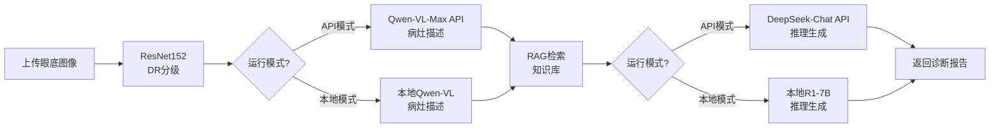

# 🏥 多模态DR智能诊断系统

基于深度学习和RAG增强推理的糖尿病视网膜病变（Diabetic Retinopathy, DR）智能诊断系统，提供自动化DR分级、病灶描述和个性化治疗建议。

## ✨ 核心功能

| 功能模块 | 技术方案 | 说明 |
|:---|:---|:---|
| **DR智能分级** | ResNet152 深度学习模型 | 自动识别DR严重程度（0-4级） |
| **病灶视觉描述** | Qwen-VL Max（API）或本地Qwen-VL | 生成专业的眼底病灶文字描述 |
| **治疗决策推理** | DeepSeek-Chat（API）或本地R1-7B | 结合RAG检索，提供可追溯的诊疗建议 |
| **知识库检索** | FAISS向量数据库 + Sentence-Transformer | 医疗指南精准匹配和引用 |

---

## 🚀 快速开始

### 前置要求

- **Python**: 3.8 - 3.10
- **Conda**: 用于环境管理
- **GPU**（可选）: CUDA-enabled GPU，仅本地模式需要（建议16GB+显存）

### 1. 环境配置

#### 方式A: 使用 Conda（推荐）

```bash
# 创建并激活环境
conda create -n dr_diagnosis python=3.10
conda activate dr_diagnosis

# 安装依赖
pip install -r requirements.txt
```

#### 方式B: 使用 venv

```bash
python -m venv venv
source venv/bin/activate  # Linux/Mac
# 或
.\venv\Scripts\activate   # Windows

pip install -r requirements.txt
```

### 2. 配置运行模式

> [!IMPORTANT]
> 系统支持两种运行模式：**API模式**（默认，推荐）和**本地模式**。请根据您的硬件资源选择合适的模式。

#### 🌐 **API模式**（默认，无需本地大模型）

适合**硬件资源有限**的用户，**仅需本地运行ResNet152**（约1GB显存），通过API调用云端大模型：

1. **复制配置模板**：
   ```bash
   cp .env.example .env
   ```

2. **编辑 `.env` 文件**，设置API密钥：
   ```bash
   # API模式开关（默认为True）
   DR_SYSTEM_USE_API_MODELS=True

   # 阿里云DashScope API Key（用于Qwen-VL，从 https://dashscope.aliyun.com/ 获取）
   DR_SYSTEM_DASHSCOPE_API_KEY=sk-xxxxxxxxxxxxx

   # DeepSeek API Key（用于推理LLM，从 https://platform.deepseek.com/ 获取）
   DR_SYSTEM_DEEPSEEK_API_KEY=sk-xxxxxxxxxxxxx
   ```

3. **准备模型文件**：
   - 下载 [ResNet152 DR分级模型](链接) 到 `models/best_model_resnet152_simple_finetune.pth`
   - ✅ **无需下载** Qwen-VL 或 R1-7B 大模型

#### 💻 **本地模式**（需要大型GPU）

适合拥有**充足GPU资源**（建议**16GB+显存**）且注重数据隐私的用户：

1. **编辑 `.env` 文件**：
   ```bash
   DR_SYSTEM_USE_API_MODELS=False
   ```

2. **下载所有模型文件**到相应目录：
   ```
   models/
   ├── best_model_resnet152_simple_finetune.pth   # DR分级模型
   ├── Qwen-VL/                                   # Qwen-VL完整模型
   └── R1-7B-finetuned/                          # R1-7B完整模型
   ```

### 3. 初始化知识库

> [!NOTE]
> 首次运行前必须初始化向量数据库，该步骤将医疗知识库转换为可检索的向量格式。

```bash
python scripts/init_vector_db.py
```

**输出示例**：
```
✅ 初始化向量数据库...
✅ 加载文档: data/knowledge_base/dr_treatment_guidelines.txt
✅ 文本分块: 128 个文档片段
✅ 生成向量嵌入...
✅ 保存到: ./data/vector_db
✅ 向量数据库初始化完成！
```

### 4. 启动服务

```bash
python run_service.py
```

**服务启动成功后**：
- 🌐 **API服务**: http://localhost:8000
- 📖 **API文档**: http://localhost:8000/docs
- 🩺 **健康检查**: http://localhost:8000/health

> [!TIP]
> 打开 `web/frontend.html` 使用可视化界面进行诊断

---

## 📂 项目结构

```
multimodal_diagnosis_system/
├── app/                          # 主应用代码
│   ├── main.py                   # FastAPI应用入口
│   ├── config/                   # 配置管理
│   │   └── settings.py           # 系统配置（支持环境变量覆盖）
│   ├── api/                      # API路由和数据模型
│   │   └── routes.py             # RESTful API定义
│   ├── core/                     # 核心业务模块
│   │   ├── vision/               # 视觉模型
│   │   │   ├── dr_grader.py      # ResNet152 DR分级
│   │   │   └── qwen_vl.py        # Qwen-VL病灶描述
│   │   ├── llm/                  # 大语言模型
│   │   │   └── loader.py         # LLM加载器
│   │   ├── rag/                  # RAG检索增强生成
│   │   │   └── chain_builder.py  # RAG链构建
│   │   └── api_models.py         # API模型包装器
│   ├── services/                 # 业务服务层
│   │   └── diagnosis.py          # 诊断服务编排
│   └── utils/                    # 工具函数
│
├── data/                         # 数据存储
│   ├── vector_db/                # FAISS向量数据库（生成）
│   └── knowledge_base/           # 医疗知识库原始文本
│       └── dr_treatment_guidelines.txt
│
├── models/                       # 模型权重文件
│   ├── best_model_resnet152_simple_finetune.pth
│   ├── Qwen-VL/                  # 本地模式需要
│   └── R1-7B-finetuned/          # 本地模式需要
│
├── scripts/                      # 工具脚本
│   ├── init_vector_db.py         # 初始化向量数据库
│   ├── test_system.py            # 系统测试
│   └── deploy.py                 # 部署脚本
│
├── web/                          # 前端界面
│   └── frontend.html             # Web可视化界面
│
├── run_service.py                # 🚀 服务启动入口
├── requirements.txt              # Python依赖
├── .env.example                  # 环境变量模板
└── README.md                     # 本文档
```

---

## 📖 使用指南

### API调用

#### 诊断接口

**POST** `/api/diagnose`

上传眼底图像，系统将返回DR分级、病灶描述和治疗建议。

**请求示例**（Python）:
```python
import requests

# 上传图像
with open("fundus_image.jpg", "rb") as f:
    files = {"file": f}
    response = requests.post("http://localhost:8000/api/diagnose", files=files)

result = response.json()

# 解析结果
print(f"DR等级: {result['dr_grade']} - {result['dr_grade_description']}")
print(f"置信度: {result['confidence']:.2%}")
print(f"\n病灶描述:\n{result['lesion_description']}")
print(f"\n治疗建议:\n{result['recommendations']}")
print(f"\n参考文献:\n{', '.join(result['references'])}")
```

**响应示例**:
```json
{
  "dr_grade": 2,
  "dr_grade_description": "中度非增殖性DR",
  "confidence": 0.89,
  "lesion_description": "眼底可见多处微动脉瘤，散在点状出血，部分区域可见硬性渗出，黄斑区轻度水肿...",
  "recommendations": "立即进行全面的眼科评估；每3-4个月进行一次眼底检查；可能需要激光治疗...",
  "references": ["中华医学会眼科分会糖尿病眼病防治指南", "2021 AAO DR临床指南"],
  "processing_time_seconds": 8.3
}
```

#### 健康检查接口

**GET** `/health`

检查系统运行状态。

```bash
curl http://localhost:8000/health
```

**响应**:
```json
{
  "status": "healthy",
  "version": "3.0.0",
  "mode": "API模式",
  "models_loaded": {
    "dr_grading": true,
    "vision_llm": "Qwen-VL-Max (API)",
    "reasoning_llm": "DeepSeek-Chat (API)",
    "vector_db": true
  }
}
```

### Web界面

直接在浏览器中打开 `web/frontend.html`，操作步骤：

1. **上传眼底图像**（支持 JPG/PNG）
2. **点击"开始诊断"**
3. **查看结果**：
   - DR分级和置信度
   - 病灶视觉描述
   - 治疗建议（带可追溯引用）
   - 推理过程（思维链展示）

---

## ⚙️ 配置说明

所有配置项在 `app/config/settings.py` 中定义，支持通过环境变量覆盖（前缀：`DR_SYSTEM_`）。

### 主要配置项

| 配置项 | 默认值 | 说明 |
|:---|:---|:---|
| `USE_API_MODELS` | `True` | 是否使用API模式 |
| `DASHSCOPE_API_KEY` | - | 阿里云DashScope API密钥（API模式必需） |
| `DEEPSEEK_API_KEY` | - | DeepSeek API密钥（API模式必需） |
| `QWEN_VL_MODEL_NAME` | `qwen-vl-max` | Qwen-VL API模型名称 |
| `DEEPSEEK_MODEL_NAME` | `deepseek-chat` | DeepSeek API模型名称 |
| `HOST` | `0.0.0.0` | 服务器监听地址 |
| `PORT` | `8000` | 服务器端口 |
| `LLM_TEMPERATURE` | `0.3` | LLM生成温度（越低越确定性） |
| `TOP_K` | `3` | RAG检索文档数量 |
| `CHUNK_SIZE` | `500` | 知识库分块大小 |
| `MAX_UPLOAD_SIZE` | `52428800` | 最大上传文件大小（50MB） |

**编辑 `.env` 文件**即可覆盖默认配置：
```bash
DR_SYSTEM_PORT=8080
DR_SYSTEM_LLM_TEMPERATURE=0.5
DR_SYSTEM_TOP_K=5
```

---

## 🔍 系统架构

### 诊断流程



### 三阶段处理

#### 1️⃣ **第一阶段：DR智能分级**
- **模型**: ResNet152（本地）
- **输入**: 眼底图像（224×224）
- **输出**: DR等级（0-4）+ 置信度
- **处理时间**: ~0.5秒

#### 2️⃣ **第二阶段：病灶视觉描述**
- **模型**: 
  - API模式：Qwen-VL-Max（云端）
  - 本地模式：Qwen-VL（本地GPU）
- **输入**: 图像 + DR分级
- **输出**: 专业病灶描述文本
- **处理时间**: ~2-5秒

#### 3️⃣ **第三阶段：RAG增强推理**
- **检索**: FAISS向量数据库检索相关医疗指南（Top-K=3）
- **推理模型**: 
  - API模式：DeepSeek-Chat（云端）
  - 本地模式：R1-7B（本地GPU）
- **输入**: DR分级 + 病灶描述 + 检索到的医疗指南
- **输出**: 思维链推理 + 治疗建议 + 可追溯引用
- **处理时间**: ~3-8秒

### 技术栈

| 层级 | 技术 |
|:---|:---|
| **Web框架** | FastAPI 0.104+ |
| **深度学习** | PyTorch 2.0+, Transformers 4.35+ |
| **视觉模型** | ResNet152, Qwen-VL / Qwen-VL-Max(API) |
| **语言模型** | R1-7B / DeepSeek-Chat(API) |
| **向量数据库** | FAISS |
| **嵌入模型** | Sentence-Transformers (all-MiniLM-L6-v2) |
| **前端** | 原生 HTML/CSS/JavaScript |

---

## 🔑 获取API密钥

### DashScope（Qwen-VL）

1. 访问 [DashScope官网](https://dashscope.aliyun.com/)
2. 注册阿里云账号并登录
3. 进入"API-KEY管理"创建新密钥
4. 复制密钥到 `.env` 文件的 `DR_SYSTEM_DASHSCOPE_API_KEY`

### DeepSeek

1. 访问 [DeepSeek平台](https://platform.deepseek.com/)
2. 注册并登录账号
3. 进入"API Keys"页面创建新密钥
4. 复制密钥到 `.env` 文件的 `DR_SYSTEM_DEEPSEEK_API_KEY`

---

## 🧪 测试

### 运行完整测试
```bash
python scripts/test_system.py
```

### 测试单个组件
```bash
# 测试DR分级
python -c "from app.core.vision.dr_grader import DRGrader; DRGrader().test()"

# 测试RAG检索
python scripts/test_rag_diagnosis.py
```

---

## 🐛 故障排除

### 常见问题

#### 1. **启动时提示"模型文件不存在"**
**原因**: ResNet152模型文件未下载  
**解决**: 确保 `models/best_model_resnet152_simple_finetune.pth` 文件存在

#### 2. **API模式报错"Invalid API Key"**
**原因**: API密钥配置错误  
**解决**: 检查 `.env` 文件中的 `DASHSCOPE_API_KEY` 和 `DEEPSEEK_API_KEY` 是否正确

#### 3. **向量数据库初始化失败**
**原因**: 知识库文件缺失  
**解决**: 确保 `data/knowledge_base/dr_treatment_guidelines.txt` 文件存在，然后重新运行：
```bash
python scripts/init_vector_db.py
```

#### 4. **本地模式显存不足**
**原因**: GPU显存不足以同时加载多个大模型  
**解决**: 切换到API模式（编辑 `.env`，设置 `DR_SYSTEM_USE_API_MODELS=True`）

#### 5. **诊断速度慢**
**建议**:
- API模式：检查网络连接
- 本地模式：确保使用GPU（检查CUDA是否可用）
- 调整 `.env` 中的 `DR_SYSTEM_MAX_CONCURRENT_REQUESTS` 控制并发

---

## 📝 版本历史

### v3.0.0（当前版本）
- ✅ 新增API模式支持（DashScope + DeepSeek）
- ✅ 本地模式和API模式自动切换
- ✅ 优化RAG检索链
- ✅ 完善配置管理系统

### v2.0.0
- 集成RAG增强推理
- 添加Qwen-VL病灶描述
- Web可视化界面

### v1.0.0
- 基础DR分级功能
- ResNet152模型训练和部署

---

## 📄 许可证

本项目采用 [LICENSE](LICENSE) 协议。

---

## 🤝 贡献

欢迎提交Issue和Pull Request！

---

## 📧 联系方式

如有问题或建议，请通过以下方式联系：
- **GitHub Issues**: [项目Issues页面](链接)
- **Email**: your-email@example.com

---

**🏥 愿每一次诊断都更精准，每一位患者都得到及时救治！**